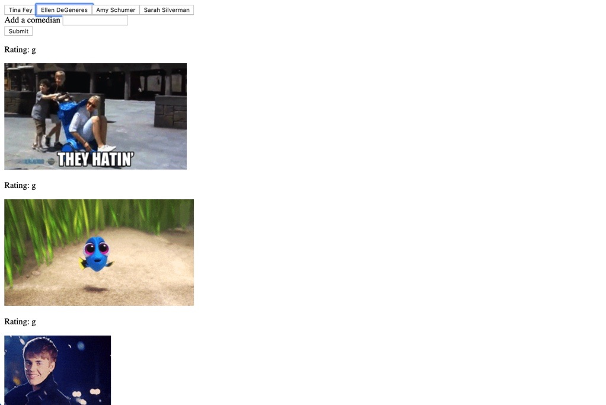

# GifTastic 
This project was completed during the 6th week of Vanderbilt's Coding Bootcamp. Connecting a site to an API URL and performing more in-depth jQuery. 

## Screen Shot

## Technologies Used 
- jQuery
- Giphy API URL

## Purpose 
To familiarize myself with APIs 

### Additional Goals
- CSS Styling 