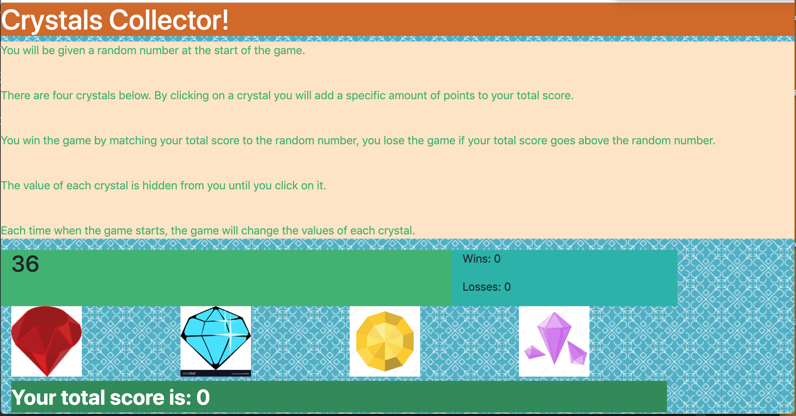

# Crystal Game 
This interactive game was created during week 4 of Vanderbilt's Coding Bootcamp. It dynamically updates the user's HTML pages with the jQuery library. 

## How it Works 
A random number is shown in the beginning of the game. Random values are also assigned to each individual crystal. The user must click on these crystals and the value will add up. The player wins if their total score matches the random number from the beginning of the game.

## Screen Shot 

## Technologies Used
- Bootstrap
- Javascript
- jQuery

